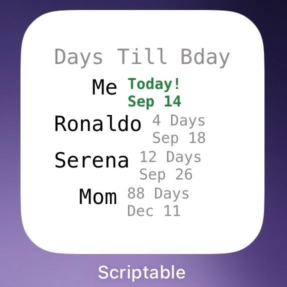
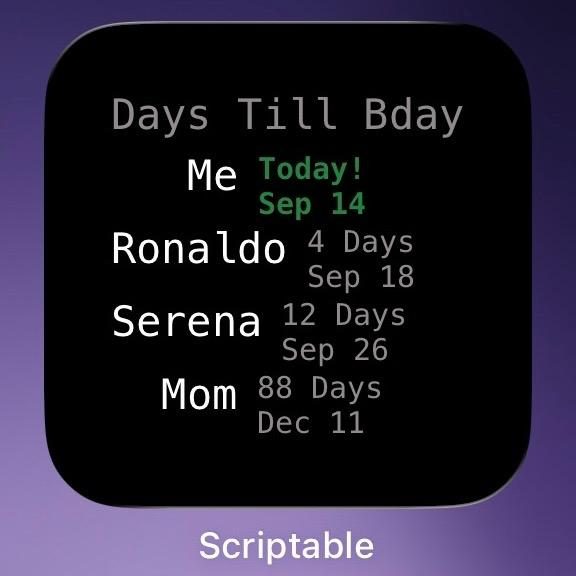
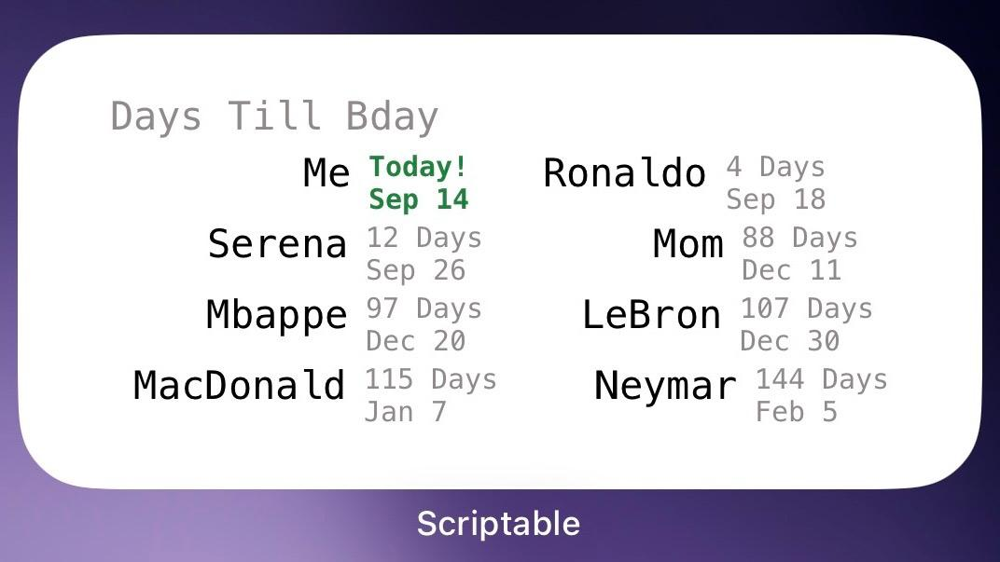
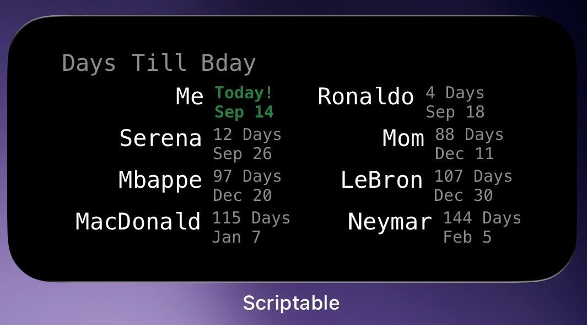
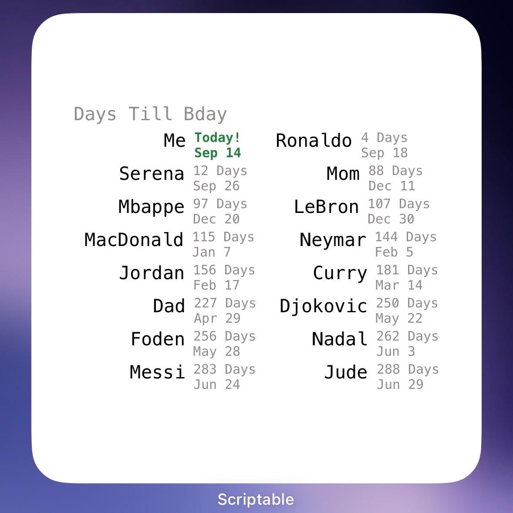
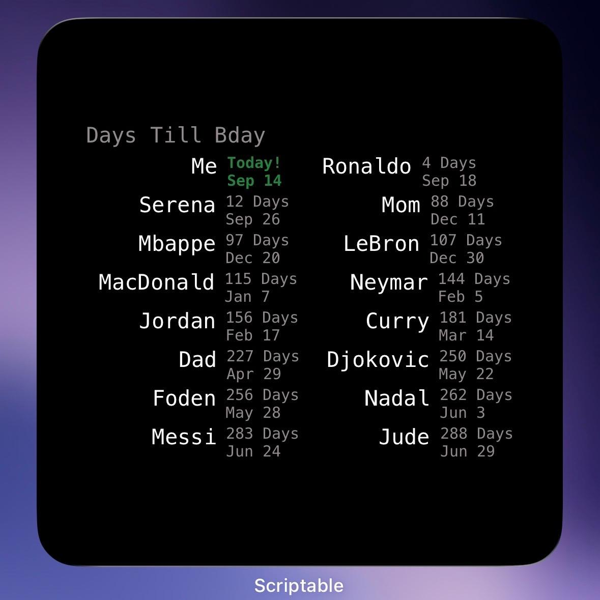

# daysUntilBirthday

Forked and modified from [lwitzani/daysUntilBirthday](https://github.com/lwitzani/daysUntilBirthday). Credit for the original project goes to [lwitzani](https://github.com/lwitzani).

A birthday countdown widget for Scriptable on iOS. Add names and birthdays directly to the script to see upcoming birthdays, sorted from nearest to farthest.

## Features

- Calculates the days remaining on every run, without modifying the birthday list.
- Displays dates as `SEP 14`.
- Highlights today's birthday with green, bold `Today!` text and a matching date.
- Automatically follows the system's light or dark appearance.
- Supports small, medium, and large Home Screen widgets.
- Requires no Contacts access, external data files, or network requests.

## Screenshots

<!-- Add an actual iPhone screenshot as widget-screenshot.png in the repository root,
then uncomment the image below.

-->

<table>
    <tr>
      <td align="center">
        <b>1x1 Lite</b><br><br>
        
      </td>
      <td align="center">
        <b>1x1 Dark</b><br><br>
        
      </td>
    </tr>
  </table>

  <table>
    <tr>
      <td align="center">
        <b>1x2 Lite</b><br><br>
        
      </td>
      <td align="center">
        <b>1x2 Dark</b><br><br>
        
      </td>
    </tr>
  </table>

  <table>
    <tr>
      <td align="center">
        <b>2x2 Lite</b><br><br>
        
      </td>
      <td align="center">
        <b>2x2 Dark</b><br><br>
        
      </td>
    </tr>
  </table>

## Setup

1. Install Scriptable on your iPhone or iPad.
2. Create a new script and paste the contents of [daysUntilBirthdayWidget.js](daysUntilBirthdayWidget.js).
3. Replace the `birthdays` array at the top of the script with your own entries:

```js
const birthdays = [
    { "name": "Alex", "date": "2000.09.14" },
    { "name": "Sam", "date": "1998.10.09" }
];
```

4. Save and run the script to preview it. Running inside Scriptable opens a large preview.
5. Add a Scriptable widget to your Home Screen, choose a size, and select your saved script in the widget settings.

No widget parameter is required. To add, edit, or remove a birthday, update the array in the script.

### Birthday format

Each entry requires a non-empty `name` and a valid `date` in `yyyy.MM.dd` format (year.month.day). Use two digits for the month and day, such as `2000.01.09`.

Enter only the name and date. The script calculates `daysUntil` in memory whenever it runs. Invalid names or dates produce an error; an empty array displays a setup message.

## Widget sizes

| Size | Columns | Maximum birthdays |
| --- | --- | --- |
| Small | 1 | 4 |
| Medium | 2 | 8 |
| Large | 2 | 16 |

The earliest upcoming birthdays are shown first. Longer names may require smaller fonts or adjusted spacing to fit.

## Appearance and customization

Light mode uses a white background and black names; dark mode uses a black background and white names. The header and regular birthday details stay gray (`#918A8A`) in both modes. Today's birthday details use green (`#15803D`) and bold text.

You can customize these values in the script:

| Setting | What it controls |
| --- | --- |
| `daysTillBdayHeader`, `daysText`, `todayText` | Header and countdown labels |
| `headerFont`, `birthdayNameFont`, `smallInfoFont` | Regular text fonts and sizes |
| `smallInfoHilightedFont`, `fontHilightedColor` | Today's birthday styling |
| `primaryTextColor`, `backgroundColor`, `fontColorGrey` | Text and background colors |
| `columns`, `maxVisibleItems` | Layout and display limits inside `createWidget()` |
| `lineLength` | Name alignment using leading spaces |
| `monthNames` in `formatDate()` | Abbreviated month names |

The header-to-body gap is set by `widget.addSpacer(4)`. The update timestamp is currently commented out in `createWidget()`; uncomment that block to display it.

## Date calculation

- A birthday today has `daysUntil: 0` and displays `Today!`.
- Birthdays that have passed this year count toward next year.
- February 29 birthdays fall on March 1 in non-leap years.
- Calculations use the device's local calendar date and avoid daylight-saving time offsets.
- Countdown values are recalculated when the script runs, rather than continuously.

## Previous versions

The script now uses only the inline `birthdays` array. The old `iCloud` and `showAll` widget parameters are ignored. Existing `customContacts.json` files are not read, modified, or deleted.

The setup GIFs and screenshot included in this repository show an earlier version and may differ from the current widget.

## License

See [LICENSE](LICENSE).
